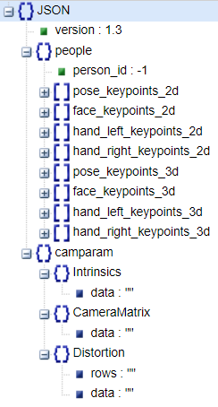

# Model

## [Sign Language Transformers (SLT)](https://github.com/neccam/slt)

Facebook AI 연구팀이 개발한 "Sign Language Transformers"는 수화를 텍스트로 번역하는데 사용할 수 있는 모델입니다. 이 모델은 수화 데이터와 해당 텍스트 설명 데이터를 활용하여 수화를 텍스트로 변환합니다. Facebook AI는 이 모델을 사용하여 다양한 수화 언어에 대한 번역을 실험적으로 수행했습니다.

[GitHub - neccam/slt: Sign Language Transformers (CVPR'20)](https://github.com/neccam/slt)

## Sign Translate

Android 버전으로 나와있는 실시간 수화→텍스트, 음성→수어

[GitHub - sign/translate: Effortless Real-Time Sign Language Translation](https://github.com/sign/translate)

# DataSet

- [AI HUB link](https://aihub.or.kr/aihubdata/data/view.do?currMenu=115&topMenu=100&aihubDataSe=realm&dataSetSn=103)

https://aihub.or.kr/aihubdata/data/view.do?currMenu=115&topMenu=100&aihubDataSe=realm&dataSetSn=103

## morpheme

- 형태소 및 비수지 가공 데이터 (.json)

```json
{
  "metaData": {
    "url": "https://blackolivevideo.blob.core.windows.net/sign-language/1123_bkyu0991/NIA_SL_SEN0005_SYN05_D.mp4",
    "name": "NIA_SL_SEN0005_SYN05_D.mp4",
    "duration": 2.6,
    "exportedOn": "2020/12/10"
  },
  "data": [
    {
      "start": 1.167,
      "end": 1.856,
      "attributes": [
        {
          "name": "여기"
        }
      ]
    }
  ]
}
```

## keypoint

- 특징점(keypoint) 가공 데이터 (.json)



## video

- 수어 영상 (.mp4)

# 문제사항

## 너무 큰 데이터 용량(총 용량: 3TB)

## 데이터 활용 모델

1. 직접 모델링
   1. 지식과 경험의 부족
      - 다음 주까지 완성이라는 계획에 대한 시간적인 한계
   2. 모델 알고리즘 선정 고민
      - KNN(K-최근접 이웃,K-Nearest Neighbor)
      - RNN-LSTM
2. 기존 모델 전이 학습
3. 인 앱에서의 활용([TensorFlow Lite](https://www.tensorflow.org/lite?hl=ko))

# STT

## returnzero STT

https://developers.rtzr.ai/

## OpenAI Whisper STT

[GitHub - openai/whisper: Robust Speech Recognition via Large-Scale Weak Supervision](https://github.com/openai/whisper)

# TTS

[Clova TTS](https://clova.ai/voice/)
